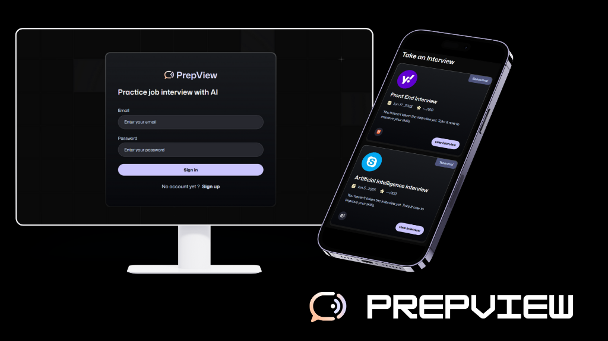

# Mock Interview Platform



## Overview

The **Mock Interview Platform** is an advanced AI-powered application designed to help users practice and improve their job interview skills. By leveraging cutting-edge AI technologies, the platform simulates realistic interview scenarios, provides real-time voice interaction, and offers detailed feedback to enhance performance.

## Features

- **AI-Powered Interviews**: Experience realistic interview sessions tailored to various job roles and difficulty levels.
- **Voice Interaction**: Engage in natural conversations with the AI interviewer using [Vapi AI](https://vapi.ai/).
- **Real-time Feedback**: Receive instant, constructive feedback on your answers, tone, and pacing powered by [Google AI](https://ai.google.dev/).
- **Secure Authentication**: Robust user management and authentication system using **Firebase**.
- **Modern UI/UX**: A sleek, responsive, and accessible interface built with **Next.js 15**, **Tailwind CSS**, and **Radix UI**.

## Tech Stack

- **Framework**: [Next.js 15](https://nextjs.org/) (App Router)
- **Language**: [TypeScript](https://www.typescriptlang.org/)
- **Styling**: [Tailwind CSS](https://tailwindcss.com/)
- **UI Components**: [Radix UI](https://www.radix-ui.com/) & [Lucide React](https://lucide.dev/)
- **Authentication & Backend**: [Firebase](https://firebase.google.com/)
- **AI Integration**:
  - [Google Generative AI](https://ai.google.dev/) (Content & Feedback)
  - [Vapi AI](https://vapi.ai/) (Voice Interaction)
- **Form Handling**: [React Hook Form](https://react-hook-form.com/) & [Zod](https://zod.dev/)

## Getting Started

Follow these steps to set up the project locally.

### Prerequisites

Ensure you have the following installed:
- [Node.js](https://nodejs.org/) (v18 or later recommended)
- npm, yarn, pnpm, or bun

### Installation

1. **Clone the repository:**
   ```bash
   git clone <repository-url>
   cd mock_interview_platform
   ```

2. **Install dependencies:**
   ```bash
   npm install
   # or
   yarn install
   # or
   pnpm install
   # or
   bun install
   ```

3. **Environment Variables:**
   Create a `.env.local` file in the root directory and add the necessary environment variables. You will need API keys for Firebase, Vapi AI, and Google AI.

   ```env
   # Example .env.local structure
   NEXT_PUBLIC_FIREBASE_API_KEY=...
   NEXT_PUBLIC_FIREBASE_AUTH_DOMAIN=...
   NEXT_PUBLIC_FIREBASE_PROJECT_ID=...
   # Add other necessary keys
   ```

4. **Run the development server:**
   ```bash
   npm run dev
   # or
   yarn dev
   # or
   pnpm dev
   # or
   bun dev
   ```

5. **Open the application:**
   Open [http://localhost:3000](http://localhost:3000) with your browser to see the result.

## Project Structure

- `app/`: Contains the application routes and pages (Next.js App Router).
- `components/`: Reusable UI components.
- `lib/`: Utility functions and library configurations.
- `public/`: Static assets like images and icons.
- `constants/`: Constant values used across the application.
- `firebase/`: Firebase configuration and initialization.

## Learn More

To learn more about the technologies used in this project, check out the following resources:

- [Next.js Documentation](https://nextjs.org/docs)
- [Tailwind CSS Documentation](https://tailwindcss.com/docs)
- [Firebase Documentation](https://firebase.google.com/docs)
- [Vapi AI Documentation](https://docs.vapi.ai/)
- [Google AI Studio](https://aistudio.google.com/)

## Deploy on Vercel

The easiest way to deploy your Next.js app is to use the [Vercel Platform](https://vercel.com/new?utm_medium=default-template&filter=next.js&utm_source=create-next-app&utm_campaign=create-next-app-readme) from the creators of Next.js.

Check out our [Next.js deployment documentation](https://nextjs.org/docs/app/building-your-application/deploying) for more details.
